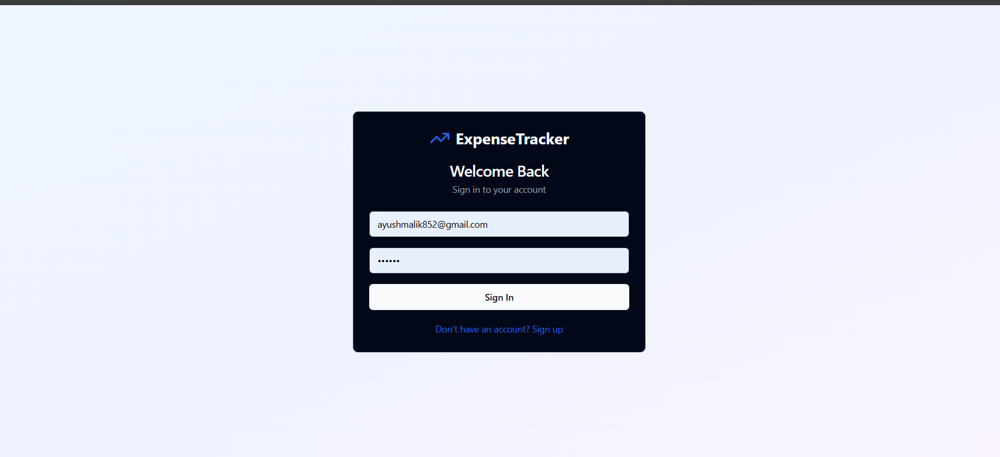
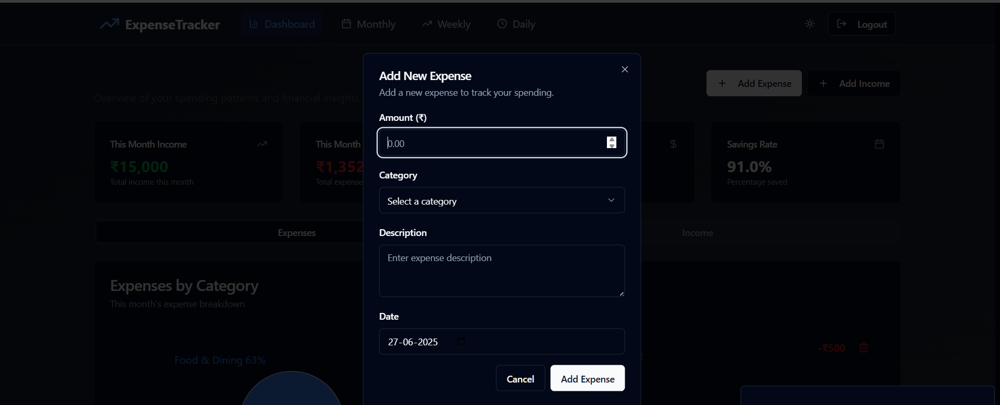
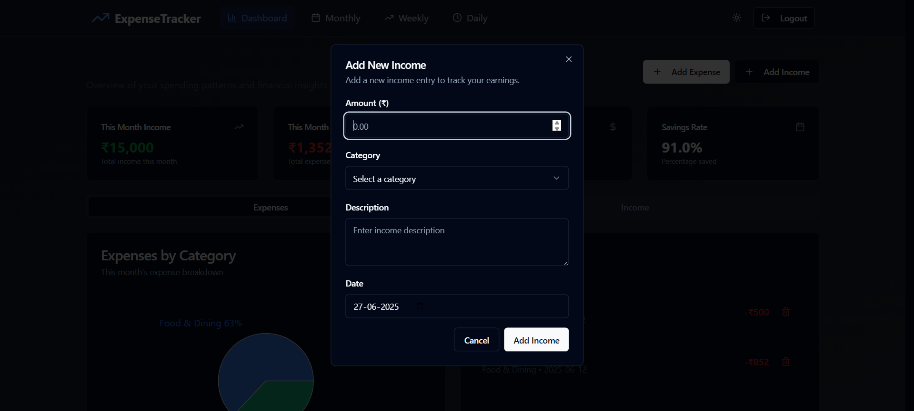
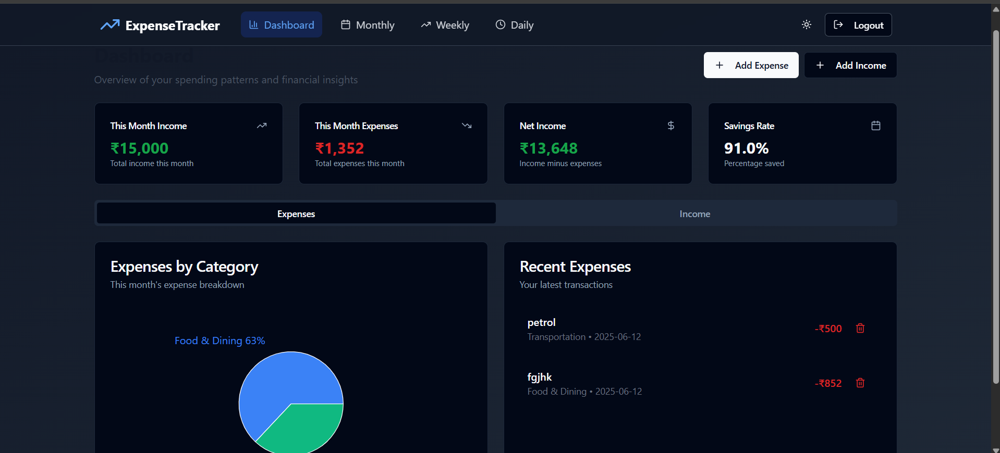

# 💰 Expense Tracker App

**Expense Tracker** is a minimal and easy-to-use web application that allows users to keep track of their personal expenses. Users can log in, add income and expense entries, and view a running balance — all stored securely with Firebase.

🌐 **Live App**: [expense-tracker-176.netlify.app](https://expense-tracker-176.netlify.app/)

---

## 🔑 Features

- ➕ Add income or expense entries
- 🧾 View your total balance and individual transactions
- 🗑️ Delete specific transactions
- 🔐 Firebase Authentication (Login/Logout)
- 📦 Firebase Firestore for persistent data storage
- 🧑‍💻 Responsive UI

---

## 🚀 Tech Stack

- **Frontend**: React.js, Tailwind CSS
- **Backend**: Firebase Authentication & Firestore
- **Routing**: React Router
- **Deployment**: Netlify

---

## 📸 Screenshots


### 🔐 Login Page


### ➕ Add Income or Expense



### 📊 Dashboard



---

## 📁 Folder Structure

```bash
expense/
├── public/
├── src/
│   ├── components/
│   ├── context/
│   ├── firebase.js
│   ├── App.jsx
│   ├── main.jsx
├── index.html
├── tailwind.config.js
├── vite.config.js
├── package.json
└── README.md
